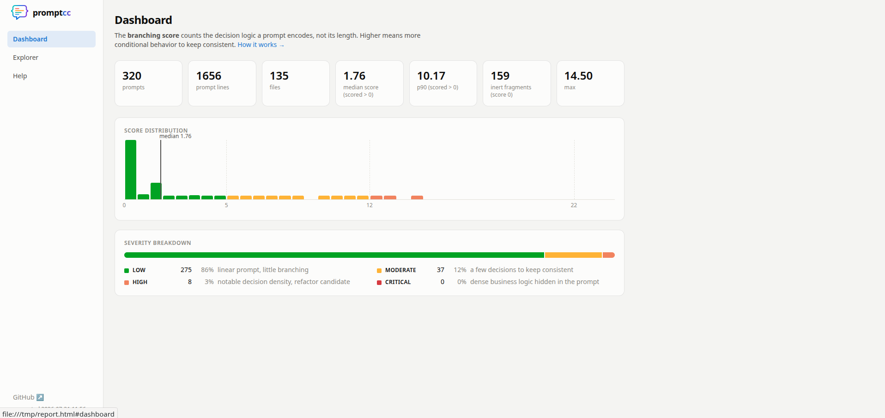
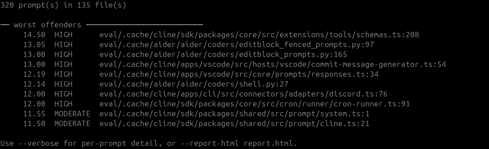
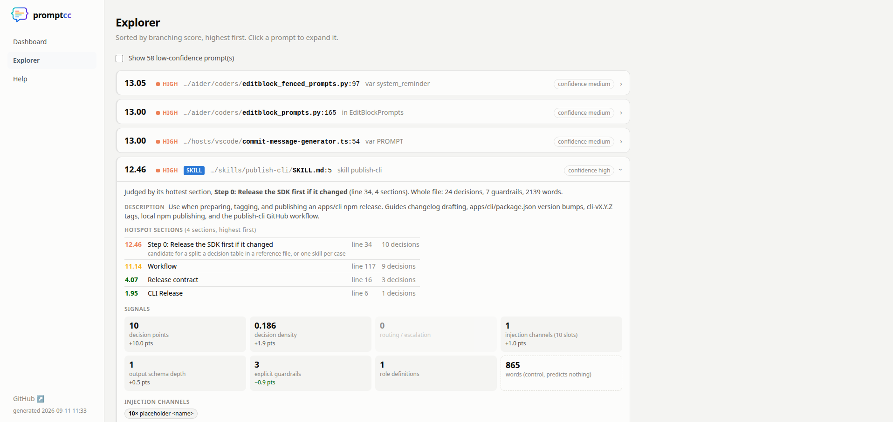

<p align="center">
  <picture>
    <source media="(prefers-color-scheme: dark)" srcset="docs/logo-promptcc-dark.png">
    
  </picture>
</p>

<p align="center"><b>Cyclomatic complexity, but for LLM prompts.</b></p>

<p align="center">
  <a href="LICENSE"></a>
  
  
  
</p>

<p align="center">
  Find the business logic hidden in your prompts, score it, and gate it in CI.
</p>

<p align="center">
  
</p>

---

Static analysis assumes a program's behavior lives in its code. In LLM-integrated apps, half of it has moved into prompts: routing decisions, guardrails, business rules. A two-line function wrapping a fifty-line prompt shows up green in every linter while its git history screams *hotspot*.

**promptcc** measures what actually predicts prompt maintenance pain: **branching, not volume**. It counts distinct things (decision points, tool routing, injection surface, output schema depth) and reports a composite branching score, in the spirit of McCabe's cyclomatic complexity, extracted straight from your source code.

> Background reading: [When code complexity lives in the prompt](https://blog.lepine.pro/en/when-code-complexity-lives-in-the-prompt/) (also available [in French](https://blog.lepine.pro/quand-la-complexite-du-code-vit-dans-le-prompt))

## Install

Download a binary from the [releases page](https://github.com/halleck45/promptcc/releases), or install with Go:

```bash
go install github.com/halleck45/promptcc/cmd/promptcc@latest
```

Linux and Windows release binaries are fully static (no libc dependency). Building from source needs a C compiler (the tree-sitter grammars are C code).

## Quick start

```bash
# scan a codebase, print the worst offenders, and write an HTML report
promptcc --report-html report.html ./src

# gate a pull request: exit 1 if any prompt scores above 22
promptcc --fail-over 22 ./src
```

promptcc figures out what to do from what you give it: a **directory or source file** is scanned for prompts embedded in the code; **any other file, or stdin,** is analyzed as a single prompt.

## Usage

### Scan a codebase

Pointed at a directory or a source file, promptcc extracts prompts directly from the code (Python, TypeScript, JavaScript, PHP, parsed with tree-sitter) and analyzes each one where it lives:

```bash
promptcc ./src                        # summary + worst offenders
promptcc --verbose ./src              # one line per prompt
promptcc --full ./src                 # full text report per prompt
promptcc --report-html report.html .  # self-contained HTML report
promptcc --json ./src                 # machine-readable output
promptcc --min-confidence high ./src  # only prompts inside known SDK calls
promptcc --fail-over 22 ./src         # CI gate
```

<p align="center">
  
</p>

### Analyze a single prompt

```bash
promptcc prompt.txt              # analyze a prompt file
cat prompt.txt | promptcc        # or pipe it in
promptcc a.txt b.txt             # compare several prompts
promptcc --json prompt.txt       # machine-readable output
```

```
── prompt.txt ──────────────────────────────
  Branching score: 10.89  [MODERATE]  a few decisions to keep consistent

  What matters (distinct things):
    decision points          n_decisions   = 3
    decision density         p_dec_ratio   = 0.429
    routing / escalation     n_tool_routes = 2
    injection channels       inject_surf   = 1  (1 slots)
    output schema depth      output_depth  = 1
    explicit guardrails      n_constraints = 3  (more guardrails, easier maintenance)
    role definitions         n_roles       = 1

  Volume (control group, predicts nothing):
    60 words · 378 chars · 7 instruction units (lines)
```

## The HTML report

`--report-html` writes a single, self-contained HTML file (no external assets) with three views:

- **Dashboard**: score distribution, severity breakdown and headline stats across all prompts.
- **Explorer**: every prompt sorted worst-first, each expanding to its per-signal breakdown and decoded source text. Low-confidence hits are hidden behind a toggle.
- **Help**: the scoring model and how to read the report.

<p align="center">
  
</p>

## How it works

### Confidence

Every reported string carries a confidence level, so you can tune the signal-to-noise ratio with `--min-confidence`:

- **high**: passed to a known LLM SDK call (Anthropic, OpenAI, Google, LangChain, Vercel AI SDK, Bedrock, Ollama)
- **medium**: bound to a prompt-like name (`system_prompt = ...`, `system:`, `'instructions' =>`)
- **low**: a long natural-language literal with no other evidence

Interpolations (f-strings, template literals, PHP `$variables`, heredocs) are decoded and counted as injection surface, exactly what a grep-based approach cannot see. Values under keys like `model`, `role` or `url` are never mistaken for prompts.

### Metrics

| Metric | What it counts | Signal |
|---|---|---|
| `n_decisions` | conditional branching points ("if", "unless", "si", "sauf si", ...) | strong positive |
| `p_dec_ratio` | fraction of instruction units that are conditional | strong positive |
| `n_tool_routes` | routing, delegation and escalation points | positive |
| `inject_surf` | distinct channels through which code injects values (`{name}`, `{{name}}`, `$var`, `[[name]]`, `%(name)s`, `<placeholder>`) | positive |
| `output_depth` | nesting depth of the requested output schema | mild positive |
| `n_constraints` | explicit guardrails ("never", "always", "ne ... jamais", ...) | **negative** (explicit limits make prompts easier to maintain) |
| `n_roles` | role and persona definitions | informational |
| `n_words`, `n_chars`, `n_instructions` | volume | none, kept as a control group |

Matching is word-token based and Unicode-aware. English and French are built in; paired XML tags (`<context>...</context>`) are recognized as structure, not injection slots.

### The branching score

```
raw    = 1.0 * n_decisions + 10.0 * p_dec_ratio + 1.5 * n_tool_routes
       + 1.0 * inject_surf + 0.5 * output_depth
relief = min(0.3 * n_constraints, 0.4 * raw)
score  = raw - relief
```

Bands: `LOW` (< 5), `MODERATE` (< 12), `HIGH` (< 22), `CRITICAL` (>= 22).

The weights are an honest v0 heuristic: the relative ordering follows published correlations for LLM-integrated applications (decision density dominates, prompt length predicts nothing, explicit guardrails correlate negatively with maintenance pain), but the absolute values are a judgment call. Calibrating them against a labeled corpus is on the roadmap.

## Roadmap

- [x] Extract prompts directly from source code (Python, TypeScript, JavaScript, PHP) via tree-sitter, so the tool works as a linter on repositories rather than on isolated text files
- [ ] Prompt template files (.txt, .md, Jinja, Blade) referenced from code
- [ ] More grammars (Go, Java, Ruby)
- [ ] SARIF output for GitHub code scanning
- [ ] pre-commit hook and GitHub Action
- [ ] Score calibration against a labeled corpus
- [ ] More languages in the lexicons (contributions welcome, see below)

## Contributing

Contributions are welcome, and adding a language to the lexicons is a great first PR. See [CONTRIBUTING.md](CONTRIBUTING.md) for the development workflow, the lexicon format, and the real-world evaluation harness.

## License

[MIT](LICENSE) © Jean-François Lépine
