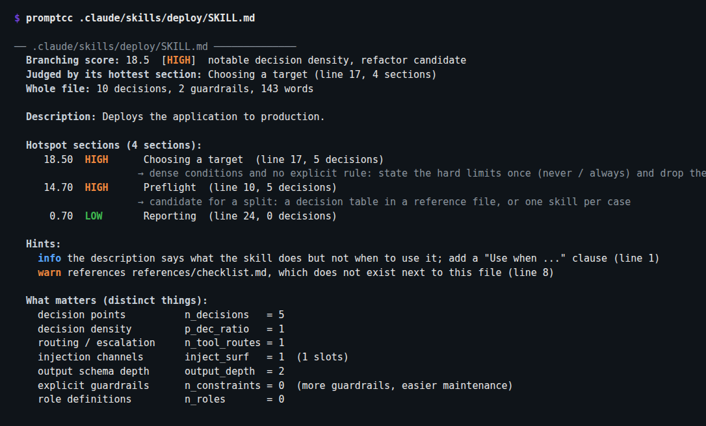

<p align="center">
  <picture>
    <source media="(prefers-color-scheme: dark)" srcset="docs/logo-promptcc-dark.png">
    
  </picture>
</p>

<p align="center"><b>Cyclomatic complexity, but for LLM prompts.</b></p>

<p align="center">
  <a href="LICENSE"></a>
  
  
  
  
</p>

<p align="center">
  Your prompts, your <code>CLAUDE.md</code>, your skills: find the business logic hiding in them, score it, gate it in CI.
</p>

<p align="center">
  <a href="https://halleck45.github.io/promptcc/#skill"><b>Try it in your browser</b></a>: paste a <code>CLAUDE.md</code>, a <code>SKILL.md</code> or any prompt. No install, nothing leaves your machine.
</p>

<p align="center">
  
</p>

---

Linters assume a program's behavior lives in its code. Today half of it lives in prompts: routing decisions, guardrails, business rules. A two-line function wrapping a fifty-line prompt shows up green everywhere while its git history screams *hotspot*. A `CLAUDE.md` that grew to 400 lines of "if the ticket mentions X, then..." is the same thing, loaded into a model on every turn.

**promptcc** measures what actually predicts maintenance pain in a prompt: **branching, not length**. It counts decision points, routing, injection surface and output schema depth, and turns them into one score, the way McCabe did for code. It reads prompts straight from your source files and from the Markdown files that drive your coding agent.

> Background reading: [When code complexity lives in the prompt](https://blog.lepine.pro/en/when-code-complexity-lives-in-the-prompt/) (also [in French](https://blog.lepine.pro/quand-la-complexite-du-code-vit-dans-le-prompt))

## Get it

Pick whichever is closest to hand:

| | |
|---|---|
| **In Claude Code** | `/plugin marketplace add halleck45/promptcc` then `/plugin install promptcc@promptcc`. Ask Claude to audit your skills; it runs promptcc and proposes the fixes. |
| **With Node** | `npx promptcc .` (downloads the release binary on first run) |
| **With Go** | `go install github.com/halleck45/promptcc/cmd/promptcc@latest` |
| **Binary** | [releases page](https://github.com/halleck45/promptcc/releases), fully static on Linux and Windows |
| **In CI** | `uses: halleck45/promptcc@main` (see [GitHub Action](#in-ci)) |

## Quick start

```bash
promptcc .                              # scan a repo: code prompts, CLAUDE.md, skills, agents, rules
promptcc .claude/skills/deploy/SKILL.md # audit one skill
promptcc --report-html report.html .    # self-contained HTML report
promptcc --fail-over 22 .               # CI gate: fail if anything scores CRITICAL
```

promptcc figures out what to do from what you give it. A **directory** is scanned for prompts in the code and for prompt files. A **source file** is scanned for its prompts. **Any other file, or stdin,** is analyzed as one prompt.

## Audit your CLAUDE.md, skills and agents

If you build with Claude Code, Cursor, Copilot, Cline, Windsurf or Codex, your prompts are Markdown files. promptcc knows where they live, reads them whole, and tells you three things the score alone cannot:

<p align="center">
  
</p>

- **Which section carries the logic, and what to do about it.** Every Markdown heading is scored on its own and the file is judged by its hottest section, not by its total: summing decisions over 700 lines would only measure length. Each HIGH section comes with a remedy that fits where it lives (move it into a skill, split it into a decision table, route first).
- **What will silently misfire.** A skill whose description never says *when* to use it (the only trigger signal the model gets), a `SKILL.md` past the documented 500 lines, a subagent missing its `name` or `description`, a broken YAML header, the same rule copy-pasted across nested `CLAUDE.md` files.
- **What is missing on disk.** `references/checklist.md` or `scripts/deploy.sh` mentioned in the file but absent next to it.

The frontmatter is parsed, not scored: the body is what the model reads.

<details>
<summary><b>Every file promptcc picks up</b></summary>

| Kind | Files |
|---|---|
| `rules`, loaded every session | `CLAUDE.md`, `CLAUDE.local.md`, `AGENTS.md`, `GEMINI.md`, `.cursorrules`, `.cursor/rules/*.mdc`, `.github/copilot-instructions.md`, `.github/instructions/*.instructions.md`, `.clinerules`, `.windsurfrules`, `.windsurf/rules/`, `.claude/rules/`, `.roo/rules/`, `.kiro/steering/`, `.junie/guidelines.md`, `.augment/rules/`, `.trae/rules/` |
| `skill` | any `SKILL.md`: `.claude/skills/`, `.agents/skills/`, plugin `skills/` |
| `agent` | `.claude/agents/**/*.md`, `.github/agents/*.agent.md`, plugin `agents/*.md` with frontmatter |
| `command` | `.claude/commands/**/*.md`, plugin `commands/*.md` with frontmatter, `.gemini/commands/` |
| `template` | `*.prompt`, `*.prompt.md`, anything under a `prompts/` directory, and `.md`, `.txt`, `.jinja`, `.j2`, `.hbs`... files referenced from code |

Missing a convention? [Adding one is a ten-line PR.](CONTRIBUTING.md#adding-an-agent-file-convention)
</details>

## Scan a codebase

Pointed at a directory, promptcc extracts prompts directly from Python, TypeScript, JavaScript and PHP (parsed with tree-sitter, so f-strings, template literals and heredocs are decoded and their interpolations counted as injection surface). Prompts that moved to their own file, `prompts/system.md` or a Jinja template opened from code, are picked up too.

<p align="center">
  
</p>

```bash
promptcc --verbose ./src              # one line per prompt, with hints
promptcc --full ./src                 # full text report per prompt
promptcc --json ./src                 # machine-readable output
promptcc --min-confidence high ./src  # only prompts inside known SDK calls
```

Every string carries a **confidence**: `high` when passed to a known LLM SDK (Anthropic, OpenAI, Google, LangChain, Vercel AI SDK, Bedrock, Ollama), `medium` when bound to a prompt-like name, `low` when it just reads like instructions. Agent files are `high` by construction.

## In CI

The GitHub Action installs the release binary, scans, writes the summary to the job page, uploads the HTML report as an artifact, and fails the job above the threshold you choose:

```yaml
- uses: actions/checkout@v4
- uses: halleck45/promptcc@main
  with:
    path: .
    fail-over: "22"
```

Prefer a commit hook? promptcc ships a [pre-commit](https://pre-commit.com) hook:

```yaml
repos:
  - repo: https://github.com/halleck45/promptcc
    rev: v0.0.2
    hooks:
      - id: promptcc
        args: [--fail-over, "22"]
```

## Analyze a single prompt

The [web playground](https://halleck45.github.io/promptcc/) runs the same analyzer as WebAssembly, entirely client-side, and hands you a badge for your README. Or from the CLI:

```bash
promptcc prompt.txt              # analyze a prompt file
cat prompt.txt | promptcc        # or pipe it in
promptcc a.txt b.txt             # compare several prompts
```

## The HTML report

`--report-html` writes one self-contained file, no external assets:

- **Dashboard**: score distribution, severity breakdown, headline stats.
- **Explorer**: every prompt worst-first, each expanding to its verdict basis, hints, hotspot sections with advice, signal breakdown and decoded text.
- **Help**: the scoring model, in plain words.

<p align="center">
  
</p>

## How the score works

| Metric | What it counts | Signal |
|---|---|---|
| `n_decisions` | conditional branching points ("if", "unless", "si", "sauf si", ...) | strong positive |
| `p_dec_ratio` | fraction of instruction units that are conditional | strong positive |
| `n_tool_routes` | routing, delegation and escalation points | positive |
| `inject_surf` | distinct channels through which code injects values (`{name}`, `{{name}}`, `$var`, `[[name]]`, `%(name)s`, `<placeholder>`) | positive |
| `output_depth` | nesting depth of the requested output schema | mild positive |
| `n_constraints` | explicit guardrails ("never", "always", "ne ... jamais", ...) | **negative**: explicit limits make prompts easier to maintain |
| `n_roles` | role and persona definitions | informational |
| `n_words`, `n_chars`, `n_instructions` | volume | none, kept as a control group |

```
raw    = 1.0 * n_decisions + 10.0 * p_dec_ratio + 1.5 * n_tool_routes
       + 1.0 * inject_surf + 0.5 * output_depth
relief = min(0.3 * n_constraints, 0.4 * raw)
score  = raw - relief
```

Bands: `LOW` (< 5), `MODERATE` (< 12), `HIGH` (< 22), `CRITICAL` (>= 22). A prompt with Markdown sections is judged by its hottest section of at least three instructions; the whole-text metrics are reported alongside.

The metric set and the direction of each signal come from [Rethinking Complexity Metrics for LLM-Integrated Applications](https://arxiv.org/abs/2607.01903) (Xu, Li, Deng, Liu, Xing; 2026), which correlates candidate metrics with maintenance effort across open-source LLM apps: decision density and injection surface predict pain, length predicts nothing, explicit guardrails help. The weights are an honest v0 heuristic; calibrating them against a labeled corpus is on the roadmap.

Matching is word-token based and Unicode-aware. English and French are built in, and adding a language is a list of words.

## Roadmap

- [x] Prompts extracted from source code (Python, TypeScript, JavaScript, PHP)
- [x] Prompt template files (`.prompt`, `prompts/`, templates referenced from code)
- [x] Agent files (CLAUDE.md, AGENTS.md, skills, subagents, commands, Cursor and Copilot rules) judged by section, with hints and advice
- [x] Claude Code plugin, GitHub Action, pre-commit hook, npm launcher
- [ ] More hints: contradictory guardrails, overlapping skills
- [ ] More grammars (Go, Java, Ruby)
- [ ] SARIF output for GitHub code scanning
- [ ] Score calibration against a labeled corpus

## Contributing

Adding a language to the lexicons or a new agent-file convention is a great first PR. See [CONTRIBUTING.md](CONTRIBUTING.md) for the workflow, the real-world evaluation harness and the release checklist.

## License

[MIT](LICENSE) © Jean-François Lépine
